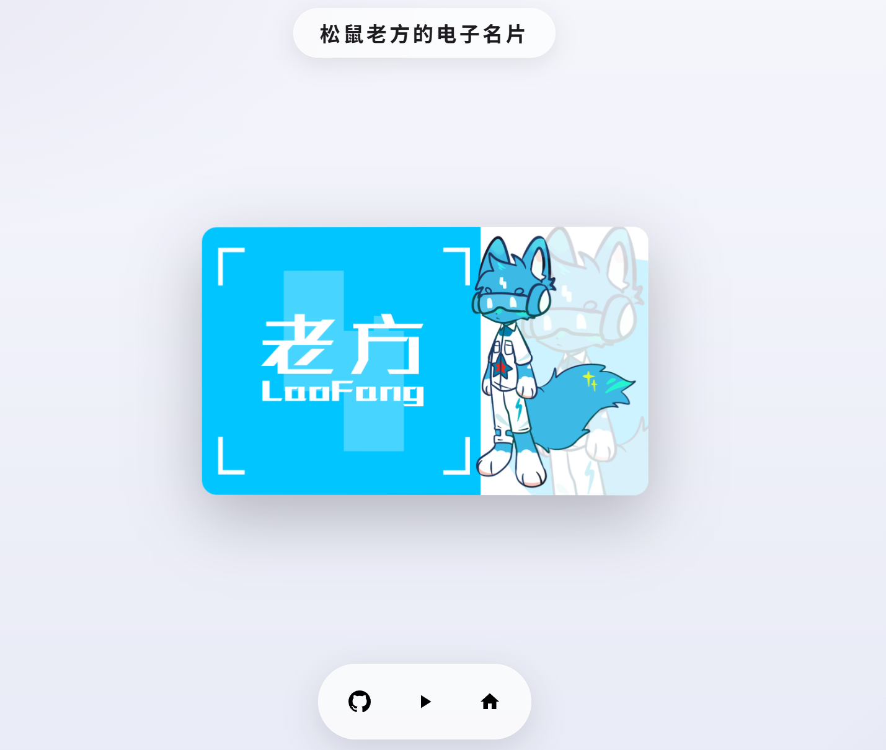

<div align="center">

# 🪪 3D 名片

**一个 3D 电子名片展示网页 ——**

[在线演示](https://stiff-ivory-owrr3tap.edgeone.dev/) ·
[GitHub](https://github.com/LaoFang114514/3d-business-card) ·
[GitCode](https://gitcode.com/LaoFang233/3d-business-card)


</div>

---

## ✨简短描述

使用 [mdui 2](https://github.com/zdhxiong/mdui)UI 组件库 & 图标 ， [Qoder](https://qoder.com/) + DeepSeek 辅助编写
```
├── index.html    # 主页面
├── main.js       # 交互逻辑（旋转、缩放、按钮）
├── style.css     # 样式与布局
├── 正.png         # 名片正面图片
├── 反.png         # 名片背面图片
└── LICENSE       # 开源许可证
```

## 🚀 部署项目

1. **克隆项目**
   ```bash
   git clone https://github.com/LaoFang114514/3d-business-card.git
   ```
2. **替换名片图片** — 将 `正.png` 和 `反.png` 替换为你自己的名片图片
3. **修改标题** — 在 `index.html` 中修改 `.title` 文字
4. **修改链接** — 在 `main.js` 中修改 `GITHUB_URL` 和 `HOME_URL`
5. **部署** — 直接用浏览器打开 `index.html`，或部署到任意静态托管服务

## 📝 许可

本项目采用 CC0-1.0 许可，各位可随意使用、修改。

---

<div align="center">

# 🪪 3D Business Card

**A 3D digital business card showcase webpage ——**

[Live Demo](https://stiff-ivory-owrr3tap.edgeone.dev/) ·
[GitHub](https://github.com/LaoFang114514/3d-business-card) ·
[GitCode](https://gitcode.com/LaoFang233/3d-business-card)


</div>

---

## ✨ Brief Description

Built with [mdui 2](https://github.com/zdhxiong/mdui) UI component library & icons, co-developed using [Qoder](https://qoder.com/) + DeepSeek.
```
├── index.html    # Main page
├── main.js       # Interaction logic (rotation, zoom, buttons)
├── style.css     # Styles and layout
├── 正.png         # Front side of the business card
├── 反.png         # Back side of the business card
└── LICENSE       # Open source license
```

## 🚀 Deployment

1. **Clone the project**
   ```bash
   git clone https://github.com/LaoFang114514/3d-business-card.git
   ```
2. **Replace card images** — Replace `正.png` and `反.png` with your own business card images
3. **Modify the title** — Edit the `.title` text in `index.html`
4. **Modify links** — Update `GITHUB_URL` and `HOME_URL` in `main.js`
5. **Deploy** — Open `index.html` directly in a browser, or deploy to any static hosting service

## 📝 License

This project is licensed under CC0-1.0. Feel free to use and modify.

</div>
